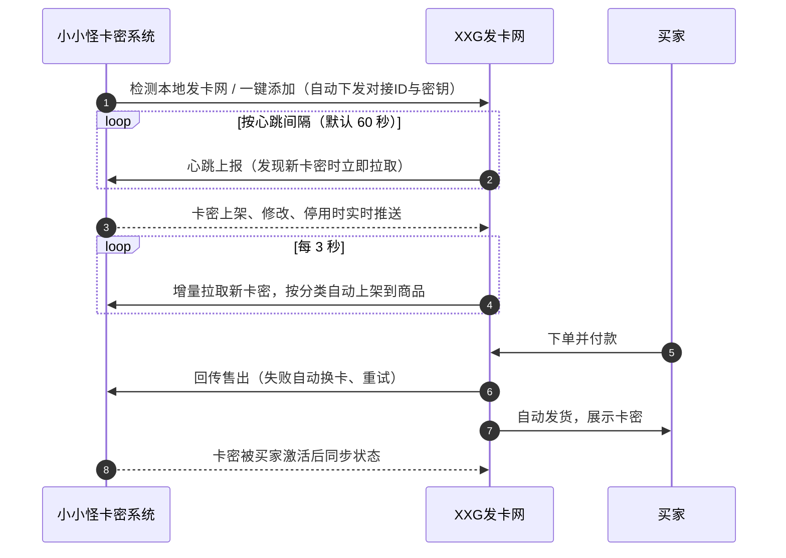

<div align="center">


# XXG发卡网

**高颜值、全自动的数字商品发卡平台 · 无感对接小小怪卡密系统**

付款即发货，卡密从生成、上架、售出到退款全程自动流转

<p>
  
  
  
  
  
  
  
</p>

<p>
  <a href="https://github.com/xxg-yyds/xxgkami-pro"></a>
</p>

<a href="#-快速开始">快速开始</a> ·
<a href="#-无感对接小小怪卡密系统">卡密系统对接</a> ·
<a href="./CARD_SHOP_INTEGRATION.md">对接协议文档</a> ·
<a href="https://github.com/xxg-yyds/xxgkami-pro">小小怪卡密系统</a> ·
<a href="http://www.xxgkami.com">官方网站</a>

</div>

---

##  项目简介

XXG发卡网是一套面向数字商品的自动发货平台，适合销售游戏点卡、影音会员、软件激活码、授权卡密等虚拟商品。买家下单付款后系统自动发卡，卡密直接展示在订单页面，并可通过邮件送达；站长在管理后台即可完成商品、卡密、订单、买家、优惠券与系统配置的全部管理。

它最大的特点是与 **[小小怪卡密系统（xxgkami-pro）](https://github.com/xxg-yyds/xxgkami-pro)** 原生打通：两边部署在同一台服务器或同一内网时，在卡密系统中点一下「一键添加」即可完成对接。此后卡密的上架、同步、售出、退款、停用全部自动流转，站长无需再手动搬运卡密。

> [!TIP]
> 小小怪卡密系统负责卡密的生成、加密与验证，XXG发卡网负责商品展示、收款与发货。两者搭配使用，即可搭建一套从「制卡」到「卖卡」再到「验卡」的完整闭环。
> 卡密系统仓库：<https://github.com/xxg-yyds/xxgkami-pro>

---

##  核心优势

<table>
  <tr>
    <td width="50%" valign="top">
      <br />
      <b>一键对接卡密系统</b><br />
      同机或内网部署时，卡密系统自动发现本站并下发对接ID与密钥，不用复制粘贴任何配置。
    </td>
    <td width="50%" valign="top">
      <br />
      <b>四重同步保障</b><br />
      实时推送、每 3 秒定时同步、心跳触发同步、每 30 分钟全量对账，新卡密几秒内自动上架。
    </td>
  </tr>
  <tr>
    <td valign="top">
      <br />
      <b>绝不重复售卖</b><br />
      发货前先向卡密系统确认售出，卡密已被他处使用时自动换卡，同一张卡密只会卖给一位买家。
    </td>
    <td valign="top">
      <br />
      <b>自动配卡</b><br />
      按「应用 + 规格」或自定义分类，把卡密自动上架到指定商品，一个商品可以配置多个分类。
    </td>
  </tr>
  <tr>
    <td valign="top">
      <br />
      <b>状态双向联动</b><br />
      卡密系统暂停对接时自动停售、恢复后自动开售；退款时可把卡密退回卡密系统重新上架。
    </td>
    <td valign="top">
      <br />
      <b>安全可靠</b><br />
      全部通信使用 HMAC-SHA256 签名，时间戳与随机串防重放，并校验卡密系统的响应签名。
    </td>
  </tr>
  <tr>
    <td valign="top">
      <br />
      <b>不碰卡密本身</b><br />
      对接只读取未使用的卡密并回传上架、售出信息，不修改卡密内容，不影响卡密的验证与激活。
    </td>
    <td valign="top">
      <br />
      <b>开箱即用</b><br />
      首次启动自动建库建表并写入示例数据，前后端分离，桌面端与手机端均可流畅使用。
    </td>
  </tr>
</table>

---

##  无感对接小小怪卡密系统

「无感」指的是：对接一次之后，站长几乎感知不到两套系统之间的存在。卡密在 [小小怪卡密系统](https://github.com/xxg-yyds/xxgkami-pro) 里生成，几秒后就出现在发卡网对应商品的库存里；买家买走后，卡密系统里立即显示「已被发卡网售出」。整个过程不需要人工上架、导出导入或核对。



### 一键对接，零配置

- 发卡网提供标准的发现接口 `/.well-known/xxgkami-card-shop`，在卡密系统后台点击「检测本地发卡网」即可扫描到本站。
- 选择本站后点击「一键添加」，对接ID和对接密钥由卡密系统生成并自动下发，发卡网收到后立即保存并开始心跳。
- 后台「系统设置 - 卡密系统对接」每 3 秒刷新一次对接状态，收到心跳时状态点会闪烁，对接成功直接弹出提示，无需刷新网页。
- 两套系统部署在不同服务器时，也支持手动填写对接地址、对接ID和密钥；还可额外配置一个内网地址，公网不通时自动切换。

### 四重同步，卡密秒级上架

| 方式 | 触发时机 | 作用 |
|:--|:--|:--|
| 变更推送 | 卡密系统中卡密上架、修改、暂停、删除、被使用时实时推送 | 本地库存即时增删改，事件去重，重复推送不会重复入库 |
| 定时同步 | 每 3 秒增量拉取一次尚未获取过的卡密 | 不依赖推送与心跳，任何一方遗漏都能补上；失败时逐步退避，恢复后回到 3 秒 |
| 心跳同步 | 每次心跳发现卡密系统有新卡密时立即拉取 | 与定时同步互为备份 |
| 全量对账 | 启动、对接成功、修改配置后，以及每 30 分钟一次 | 移除已下架、停用、删除的卡密，保证两边库存一致 |

定时同步在没有新卡密时不写数据库，并在独立线程中执行，网络缓慢也不会影响心跳。

### 自动配卡，按分类上架到不同商品

- 来自卡密系统的卡密按「应用 + 规格」自动分类（例如「我的软件 · 30天卡」），手动导入的卡密按导入时填写的分类名称分类。
- 为商品配置「自动配卡」分类后，该分类的卡密（包括之后从卡密系统同步来的）会自动上架到该商品；一个分类只配置给一个商品，不同规格可以分别卖给不同商品。
- 尚未配置商品的卡密进入「卡密池」，可在商品的卡密面板中勾选添加或按数量一键添加，也可以随时退回卡密池。

### 售出回传，杜绝超卖

- 买家付款后，发卡网先向卡密系统回传售出，确认成功才发货；卡密已被他处售出或已失效时，自动换一张可用卡密。
- 回传失败时使用同一订单号重试，卡密系统按订单号幂等处理，网络抖动不会造成重复售出；最终失败时释放已锁定的卡密，不会占住库存。
- 后台可一键「核对卡密状态」，查看已售卡密在卡密系统中是否已被买家激活、停用或删除。

### 状态联动，自动应对各种情况

- 卡密系统关闭本店对接时，发卡网自动暂停售卖来自卡密系统的卡密，手动导入的卡密不受影响；重新开启后自动恢复。
- 卡密系统中删除本店后，发卡网连续 3 次收到「对接ID不存在」会自动解除对接，避免一直报错。
- 订单退款时可选择回收卡密：卡密系统来源的卡密会撤销售出，回到卡密系统重新可售。
- 后台侧栏与通知中心实时显示卡密系统离线、对接暂停、卡密失效等状态。

### 对接安全

- 双方所有请求使用 HMAC-SHA256 签名，签名内容包含请求方法、路径、时间戳、随机串和请求体摘要。
- 时间戳超过 ±300 秒的请求直接拒绝，随机串 10 分钟内不可重复使用，推送事件 30 天内去重。
- 卡密系统的响应同样带签名，发卡网校验通过后才信任返回的数据。
- 一键对接只接受本机或内网来源，且只在开启「允许一键对接」后的 10 分钟内有效，对接成功后自动关闭。

完整的接口协议、签名算法与错误码见 [CARD_SHOP_INTEGRATION.md](./CARD_SHOP_INTEGRATION.md)。

---

##  功能一览

###  商城前台

| 模块 | 说明 |
|:--|:--|
| 首页与商品列表 | 分类导航、商品搜索、实时成交动态、站点公告与常见问题 |
| 商品详情 | 价格、库存、销量、购买须知，支持购买数量限制与优惠券 |
| 下单与支付 | 游客可直接下单（填写联系方式与查询密码），登录后可用余额支付；支付页显示倒计时与收款二维码，超时订单自动关闭 |
| 自动发货 | 付款后卡密立即展示在订单页并可一键复制；配置邮箱后同时发送到买家邮箱 |
| 订单查询 | 通过订单号，或联系方式加查询密码找回订单 |
| 用户中心 | 邮箱验证码注册、登录、我的订单、我的优惠券、余额与账号设置 |
| 独立店铺页 | 通过 `/s/店铺标识` 访问，可自定义店铺名称、头像、简介与商品展示方式 |

###  管理后台

| 模块 | 说明 |
|:--|:--|
| 仪表盘 | 经营数据统计、销售趋势图、分类销售占比、商品销量排行、库存告急、最新订单与卡密系统对接状态 |
| 商品与分类 | 封面图标与色调、价格与划线价、自动或人工发货、上下架、排序、实时预览；每个商品可单独管理卡密与自动配卡 |
| 卡密管理 | 按商品、分类、状态筛选；批量导入（支持 TXT 文件、全局去重）、锁定、导出、删除、上架到商品、退回卡密池；分类与自动配卡统一配置；手动同步与核对状态 |
| 订单管理 | 按状态、支付方式、时间筛选，支持人工发货、关闭、退款（可选回收卡密）、备注 |
| 优惠券 | 固定金额或折扣、最低消费门槛、适用商品范围、有效期、发放总量与每人限用次数 |
| 买家管理 | 查看买家订单、调整余额（记录流水）、封禁账号 |
| 系统设置 | 站点信息与维护模式、店铺、支付、邮件（可发测试邮件）、卡密系统对接、图标库、安全（验证码、登录失败限制、IP 白名单、登录有效期） |
| 通知中心 | 待发货订单、库存告急、卡密系统异常等实时提醒 |

###  体验与设计

- 桌面端与手机端分别适配：手机端底部导航、全屏抽屉与单列布局，桌面端侧栏与多列表格。
- 浅色、深色与跟随系统三种主题。
- 页面切换、数字滚动、卡片入场、扫码动画等细致的动效。
- 商品封面使用 Iconify 图标（Phosphor、Simple Icons、Material Design Icons 等 9 个图标库、约 4.5 万个图标，可在后台按需启用），无需上传图片即可做出统一美观的商品卡片。

---

##  技术架构

| 层 | 技术 |
|:--|:--|
| 前端 | Vue 3、Vite、Naive UI、Pinia、Vue Router、VueUse、ECharts、Iconify |
| 后端 | Spring Boot 4、Spring Data JPA（Hibernate 7）、Jackson 3、Java 21 虚拟线程 |
| 存储 | MySQL（业务数据）、Redis（登录令牌、验证码、对接防重放与事件去重） |

- 前后端分离，统一的 `{ code, message, data }` 接口格式。
- 首次启动自动建库建表，并写入管理员、示例分类、商品、卡密、优惠券、公告与常见问题。
- 卡密分配、售出与库存计算均在事务中完成，并发下单不会超卖。

```text
xxgfaka
├── backend                      Spring Boot 后端（端口 1505）
│   └── src/main/java/.../backend
│       ├── kami                 小小怪卡密系统对接（签名、心跳、同步、推送、一键对接）
│       ├── service              业务逻辑（商品、卡密分类、订单、库存、设置等）
│       ├── web                  前台、用户、后台接口
│       └── entity / repo        数据实体与仓库
├── vue                          Vue 3 前端（端口 1506）
│   └── src
│       ├── views/shop           商城前台
│       ├── views/user           用户中心
│       ├── views/admin          管理后台
│       └── components           公共组件
├── docs                         文档资源
└── CARD_SHOP_INTEGRATION.md     发卡网对接协议文档
```

---

##  快速开始

**环境要求**：JDK 21+、Maven 3.8+、Node.js 18+、MySQL 8+、Redis 5+

**1. 克隆代码**

```bash
git clone <本仓库地址>
cd xxgfaka
```

**2. 配置数据库**

修改 `backend/src/main/resources/application.properties` 中的 MySQL 与 Redis 连接信息，数据库 `xxg_faka` 会在首次启动时自动创建。

**3. 启动后端**（默认端口 `1505`）

```bash
cd backend
mvn spring-boot:run
```

**4. 启动前端**（默认端口 `1506`，`/api` 自动代理到后端）

```bash
cd vue
npm install
npm run dev
```

**5. 访问**

| 地址 | 说明 |
|:--|:--|
| `http://localhost:1506` | 商城前台 |
| `http://localhost:1506/admin` | 管理后台 |

初始管理员账号在 `application.properties` 的 `xxg.init.admin-username` / `xxg.init.admin-password` 中配置。

> [!WARNING]
> 首次登录后台后请立即修改管理员密码；上传到公开仓库前，请把 `application.properties` 中的数据库密码替换为你自己的配置或改用环境变量。

**生产部署**：执行 `npm run build` 生成 `vue/dist` 静态文件交给 Nginx 托管，后端执行 `mvn clean package -DskipTests` 打包为 JAR 运行，并在 Nginx 中把 `/api` 反向代理到后端：

```nginx
location /api {
    proxy_pass http://127.0.0.1:1505;
}
```

---

##  对接小小怪卡密系统的步骤

先按 [小小怪卡密系统部署指南](https://github.com/xxg-yyds/xxgkami-pro) 部署好卡密系统，然后任选一种方式对接。

**方式一：同一服务器或内网（推荐，一键对接）**

1. 在发卡网后台「系统设置 - 卡密系统对接」中保持「允许一键对接」开启。
2. 在卡密系统后台「发卡网对接」页面点击「检测本地发卡网」，选择 XXG发卡网后点击「一键添加」。
3. 发卡网设置页自动显示「卡密系统在线」，卡密开始自动同步。
4. 在「商品管理」中为商品配置自动配卡分类，或在「卡密管理 - 分类与自动配卡」中为每个规格选择商品。

**方式二：不同服务器（手动对接）**

1. 在卡密系统中添加发卡网，对接地址填写发卡网设置页显示的「本站对接地址」（经网站域名转发的地址）。
2. 把卡密系统生成的对接ID与密钥填入发卡网设置页，并填写卡密系统接口地址，保存后点击「检测连接」。
3. 后续步骤与一键对接相同。

---

##  当前状态与规划

- [x] 商城前台、用户中心、独立店铺页
- [x] 管理后台全部模块
- [x] 余额支付、自动发货、邮件发货、优惠券
- [x] 无感对接小小怪卡密系统（一键对接、四重同步、自动配卡、售出回传、退款回收）
- [ ] 支付宝、微信支付、USDT 真实支付通道

> [!NOTE]
> 真实支付通道尚未接入，当前默认开启「沙箱模式」，扫码页的付款为模拟支付，用于演示和测试完整流程。正式运营前请在后台关闭沙箱模式，使用余额支付或接入真实支付通道。

---

##  相关链接

| 项目 | 地址 |
|:--|:--|
| 小小怪卡密系统（GitHub） | <https://github.com/xxg-yyds/xxgkami-pro> |
| 小小怪卡密系统（Gitee） | <https://gitee.com/xiaoxiaoguai-yyds/xxgkami-pro> |
| 小小怪卡密系统官网 | <http://www.xxgkami.com> |
| 小小怪卡密系统下载 | <https://github.com/xxg-yyds/xxgkami-pro/releases> |
| 发卡网对接协议 | [CARD_SHOP_INTEGRATION.md](./CARD_SHOP_INTEGRATION.md) |

---

<div align="center">

如果这个项目对你有帮助，欢迎点一个 Star，也欢迎去给 [小小怪卡密系统](https://github.com/xxg-yyds/xxgkami-pro) 点一个 Star。

</div>
